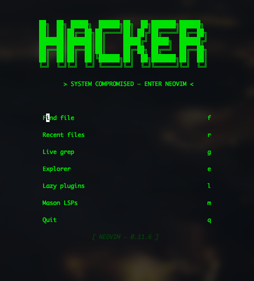
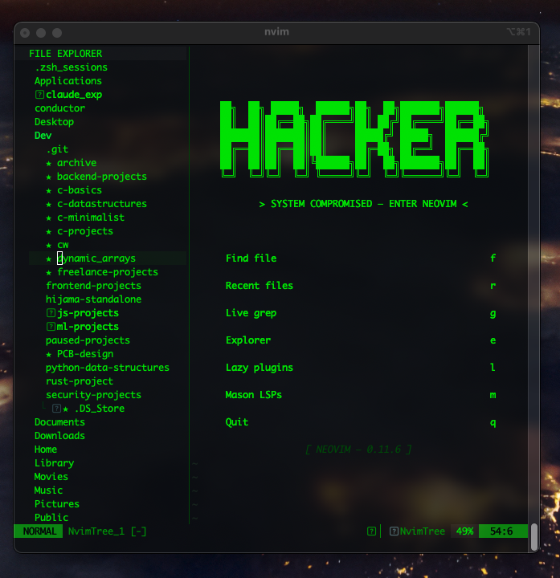
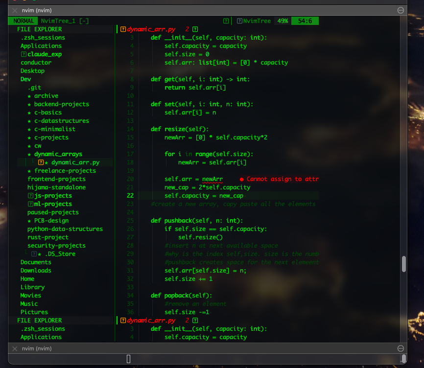

# quebec — Neovim Configuration

> **> SYSTEM COMPROMISED — ENTER NEOVIM <**

A hacker-aesthetic Neovim 0.11+ configuration built around a strict black-and-green terminal palette, native LSP, and modular lazy-loaded plugins.

---

## Screenshots

### Dashboard


The `alpha-nvim` dashboard greets you with a pixelated **HACKER** ASCII header and quick-access keybindings. The tagline `> SYSTEM COMPROMISED — ENTER NEOVIM <` sets the tone.

### Dashboard + File Explorer


`nvim-tree` opens on the left (30 cols wide) alongside the dashboard. The explorer respects the hacker palette — green folder names, git status markers, and no noise.

### Editor


Active editing view with `lualine` status bar, buffer tabs via `bufferline`, and the full green-on-black colorscheme applied to syntax highlighting.

---

## Directory Structure

```
quebec/
├── init.lua                   # Entry point — loads core, sets colorscheme, bootstraps lazy
├── lazy-lock.json             # Plugin version lockfile
├── colors/
│   └── hacker.lua             # Colorscheme registration entry point
└── lua/
    ├── core/
    │   ├── options.lua        # Editor settings
    │   ├── keymaps.lua        # All keybindings
    │   └── autocmds.lua       # Autocommand groups
    ├── plugins/
    │   ├── init.lua           # Lazy.nvim bootstrap + inline plugins
    │   ├── ui.lua             # nvim-tree, lualine, bufferline, alpha, indent guides
    │   ├── telescope.lua      # Fuzzy finder + fzf-native
    │   ├── lsp.lua            # Mason + native LSP (clangd, pyright)
    │   ├── treesitter.lua     # Syntax, indent, textobjects
    │   └── completion.lua     # nvim-cmp + LuaSnip
    └── themes/
        └── hacker.lua         # Full colorscheme definition (1000+ highlight groups)
```

---

## Colorscheme: `hacker`

**Philosophy**: strict `#000000` black background, `#00FF00`-family greens for all code, red/amber reserved exclusively for diagnostics and errors. Zero visual noise.

### Palette

| Role | Hex | Usage |
|------|-----|-------|
| `black` | `#000000` | Background |
| `black_mid` | `#111111` | Popups, floats |
| `black_hi` | `#1A1A1A` | Status line bg |
| `selection` | `#0A1A00` | Visual / cursor line |
| `g2` | `#007700` | Comments, line numbers |
| `g4` | `#00BB00` | Normal text, identifiers |
| `g5` | `#00DD00` | Strings |
| `g6` | `#00FF00` | Keywords, functions, selected buffers |
| `g7` | `#44FF44` | Numbers, booleans |
| `lime` | `#88FF00` | Type keywords |
| `mint` | `#00FF88` | Preprocessor, macros |
| `err` | `#FF2200` | Errors, delete markers |
| `warn` | `#AAAA00` | Warnings (minimal) |

The theme covers every plugin: NvimTree, Telescope, BufferLine, Which-key, Gitsigns, Lualine, Treesitter semantic tokens, and all LSP diagnostic groups.

---

## Core Settings (`lua/core/options.lua`)

| Category | Settings |
|----------|----------|
| **Display** | `termguicolors`, `cursorline`, `signcolumn=yes`, `colorcolumn=80`, listchars for tabs/trails |
| **Numbers** | Line numbers on, relative numbers off |
| **Tabs** | `expandtab`, `tabstop=4`, `shiftwidth=4`, `smartindent` |
| **Search** | `ignorecase`, `smartcase`, `hlsearch`, `incsearch` |
| **Files** | No swapfile/backup, `undofile` on, `autowrite`/`autoread`, hidden buffers |
| **Clipboard** | `unnamedplus` (system clipboard) |
| **Performance** | `updatetime=250ms`, `timeoutlen=400ms` |
| **Folding** | Treesitter-powered, starts fully open (`foldlevel=99`) |
| **Splits** | `splitbelow`, `splitright` |
| **Mouse** | Enabled |

---

## Keymaps (`lua/core/keymaps.lua`)

**Leader**: `<Space>`

### File / Buffer

| Key | Action |
|-----|--------|
| `<leader>w` | Save |
| `<leader>q` | Quit |
| `<leader>Q` | Force quit all |
| `<S-h>` / `<S-l>` | Previous / next buffer |
| `<leader>bd` | Delete buffer |

### Navigation

| Key | Action |
|-----|--------|
| `<C-h/j/k/l>` | Move between splits |
| `<C-Up/Down/Left/Right>` | Resize splits |
| `<leader>s` | Horizontal split |
| `<leader>v` | Vertical split |

### Telescope

| Key | Action |
|-----|--------|
| `<leader>ff` | Find files |
| `<leader>fg` | Live grep |
| `<leader>fb` | Buffers |
| `<leader>fh` | Help tags |
| `<leader>fr` | Recent files |
| `<leader>fc` | Commands |
| `<leader>fd` | Diagnostics |

### LSP

| Key | Action |
|-----|--------|
| `gd` | Go to definition |
| `gD` | Go to declaration |
| `gr` | References |
| `gi` | Implementation |
| `K` | Hover docs |
| `<leader>ca` | Code actions |
| `<leader>rn` | Rename |
| `<leader>lf` | Format |
| `]d` / `[d` | Next/prev diagnostic |
| `<leader>dl` | Diagnostic loclist |

### Other

| Key | Action |
|-----|--------|
| `<leader>e` | Toggle file explorer |
| `<leader>E` | Focus file explorer |
| `<leader>/` | Toggle comment |
| `<leader>p` | Paste without yanking |
| `<Esc>` | Clear search highlight |
| `J` / `K` (visual) | Move lines up/down |

---

## Autocommands (`lua/core/autocmds.lua`)

| Group | Trigger | Behavior |
|-------|---------|----------|
| `AutoSave` | FocusLost, BufLeave | Silently writes buffer |
| `FiletypeIndent` | FileType | Python/YAML/TOML → 4sp; C/JS/Lua/JSON → 2sp; Makefiles → tabs |
| `TrimWhitespace` | BufWritePre | Strips trailing whitespace |
| `YankHighlight` | TextYankPost | Highlights yanked region for 200ms |
| `RestoreCursor` | BufReadPost | Restores last cursor position |
| `AutoReload` | FocusGained, CursorHold | Reloads file if changed on disk |
| `WinResize` | VimResized | Rebalances split sizes |
| `CAutoFormat` | BufWritePre (*.c, *.h, *.cpp) | Runs `clang-format` if available |
| `PythonAutoFormat` | BufWritePre (*.py) | LSP format on save |
| `CloseWithQ` | FileType help/man/qf/etc. | Maps `q` to close window |

---

## Plugins

### Plugin Manager: `lazy.nvim`

Bootstrapped in `lua/plugins/init.lua`. Disabled built-ins: `gzip`, `matchit`, `netrw`, `tarPlugin`, `tohtml`, `tutor`, `zipPlugin`.

### UI (`lua/plugins/ui.lua`)

**`nvim-tree`** — File explorer
- Left side, 30 cols, syncs with cwd
- Shows git status, dotfiles, modified files
- Icons: `▸►` folders, `✗✓➜★` git states

**`lualine`** — Status line
- Custom hacker palette per mode
- Sections: mode | branch+diff+diagnostics | filename | encoding+format+filetype | progress | location

**`bufferline`** — Buffer tabs
- MRU sort, diagnostic error/warn counts
- Thin separators, offset for NvimTree panel
- Selected buffer: bright green bold

**`indent-blankline`** — Indent guides
- Character: `│`, scope highlighting enabled

**`alpha-nvim`** — Dashboard
- ASCII HACKER header
- Buttons: `f` find files, `r` recent, `g` grep, `e` explorer, `l` lazy, `m` mason, `q` quit
- Footer: Neovim version

### Telescope (`lua/plugins/telescope.lua`)

Fuzzy finder accelerated by `telescope-fzf-native`:
- Horizontal layout, ascending sort, 55% preview width
- `find_files`: uses `fd`, shows hidden files, excludes `.git`
- `live_grep`: `--hidden` flag
- Insert mappings: `C-j/k` move, `C-x/v` splits, `C-q` quickfix

### LSP (`lua/plugins/lsp.lua`)

Uses **native `vim.lsp.config`** (Neovim 0.11+, no nvim-lspconfig dependency).

**Mason**: GUI server installer with custom icons
**mason-lspconfig**: auto-installs servers

| Server | Language | Config |
|--------|----------|--------|
| `clangd` | C/C++ | Background indexing, clang-tidy, IWYU, detailed completions |
| `pyright` | Python | Workspace diagnostics, auto-search paths, basic type checking |

Diagnostics: virtual text with `●` prefix, float on `CursorHold`, undercurl underlines, severity-sorted.
Icons: `●` Error, `▲` Warn, `✨` Hint, `ℹ` Info.

### Treesitter (`lua/plugins/treesitter.lua`)

Languages: C, C++, Python, Lua, Vim, Markdown, JSON, YAML, Bash, Make, TOML

- Auto-install enabled, disabled for files >200KB
- Treesitter-powered folding and indentation
- Incremental selection: `C-space` expand, `<BS>` shrink

**Textobjects**:
- Select: `af/if` (function), `ac/ic` (class), `aa/ia` (parameter), `ab/ib` (block)
- Move: `]f/[f` next/prev function, `]c/[c` next/prev class
- Swap: `<leader>a/A` swap parameter with next/prev

### Completion (`lua/plugins/completion.lua`)

**LuaSnip** + **nvim-cmp**:

Sources by priority: LSP (1000) › LuaSnip (750) › Buffer (500) › Path (250)

| Key | Action |
|-----|--------|
| `Tab` | Select next / expand snippet |
| `C-j` / `C-k` | Select item |
| `C-b` / `C-f` | Scroll docs |
| `C-Space` | Trigger completion |
| `C-e` | Abort |
| `Enter` | Confirm |

Formatting via `lspkind`: symbol+text mode, labels `[LSP]` `[Snip]` `[Buf]` `[Path]`.
Sorting: exact match › score › recently used › kind.
Cmdline: `/`/`?` use buffer source, `:` uses path+cmdline.

### Inline Plugins

| Plugin | Load | Purpose |
|--------|------|---------|
| `nvim-autopairs` | InsertEnter | Auto-close brackets/quotes |
| `Comment.nvim` | BufReadPre | `gcc`/`gbc` toggle comments |
| `which-key.nvim` | VeryLazy | Keymap popup guide |
| `gitsigns.nvim` | BufReadPre | Git diff signs in gutter |

---

## Languages Supported

| Language | LSP | Treesitter | Formatting |
|----------|-----|-----------|-----------|
| C / C++ | clangd | ✓ | clang-format (auto on save) |
| Python | pyright | ✓ | LSP format (auto on save) |
| Lua | — | ✓ | 2-space indent |
| Markdown | — | ✓ | — |
| JSON / YAML / TOML | — | ✓ | — |
| Bash | — | ✓ | — |

---

## Requirements

- Neovim ≥ 0.11
- `git` (lazy.nvim bootstrap)
- `fd` (Telescope file finding)
- `ripgrep` (Telescope live grep)
- A Nerd Font (icons in tree, lualine, bufferline)
- `clang-format` (optional, C/C++ formatting)
- `node` / `npm` (Mason LSP installs)
- `python3` (pyright)
